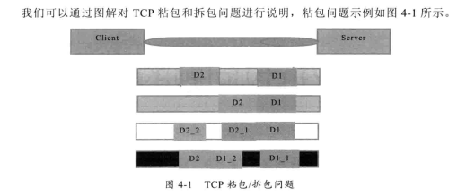

# Netty

## 第一部分 IO基础

### IO基础

1. Linux网络IO模型

```
技术背景:Linux内核将所有外部设备都看作一个文件来操作，对一个文件的读写操作会调用内核提供的系统命令，返回一个file descriptor(fd,文件描述符)。
而对一个socket的读写也会有相应的描述符，称为socketfd（socket描述符），描述符就是一个数字，它指向内核中的一个结构体（文件路径，数据区的一些属性）
UNIX提供了5种I/O模型

（1）阻塞I/O模型
最常用的阻塞IO模型，默认情况下所有文件操作都是阻塞的。我们以套接字为例讲解此模型：
在进程空间中调用recvfrom，其系统调用直到数据包到达并且被复制到应用进程的缓冲区中或者发生错误才返回
在此期间会一直等待，进程在从调用recvfrom开始到它返回的整段时间内都是被阻塞的，因此被称为阻塞IO模型。
（2）非阻塞I/O模型
recvfrom从应用层到内核的时候，如果该缓冲区没有数据就直接返回一个EWOULDBLOCK错误，
一般都对非阻塞I/O模型进行轮询检查这个状态，看内核是不是有数据到来。
（3）I/O复用模型
Linux提供select/poll,进程通过将一个或者多个fd传递给select或者poll系统调用，阻塞在select操作上，
这样select/poll可以帮助我们侦测多个fd是否处于就绪状态。select/poll是顺序扫描fd是否就绪，而且支持的fd的数量有限，因此它的使用受到了一些制约。
Linux还提供了一个epoll的系统调用，epoll使用基于事件驱动方式代替顺序扫描，因此性能更高。当有fd就绪时，立即回调函数rollback。
（4）信号驱动模型
首先开启套接字信号驱动IO功能，并通过系统调用sigaction执行一个信号处理函数（此函数调用立即返回，进程继续工作，它是非阻塞的）。
当数据准备就绪来临时，就为该进程生成一个SIGIO信号，通过信号回调通知应用程序调用recvfrom来读取数据，并通知主循环函数处理数据。
（5）异步I/O,告知内核启动某个操作，并让内核在整个操作完（包括将内核复制到用户自己的缓冲区）成后通知我们。这种模型与信号驱动模型的主要区别是：
信号驱动I/O由内核通知我们何时可以开始一个I/O操作：异步IO模型由内核通知我们操作何时已经完成。

epoll详解
可以参看一个lInux
cat /proc/sys/fs/epoll/max_user_watches 
```
参考文章
>https://segmentfault.com/a/1190000003063859
2. IO多路复用技术

```
Java的NIO核心类库多路复用器Selector就是基于epoll的多路复用技术实现的。
```

### Socket 和 ServerSocket

### 4种IO模型

1. BIO
2. 伪异步IO
3. NIO
4. AIO
5. 4种IO的对比
6. Netty优缺点

### BIO、NIO、AIO和Netty实现时间服务器的案例

1. BIO
2. NIO
3. AIO
4. Netty

### TCP拆包/粘包问题解决之道

1. TCP拆包/粘包问题说明
   
2. TCP拆包粘包问题原因

```
（1）应用程序write写入的字节大小大于套接字缓冲区大小
（2）进行MSS大小的TCP分片
（3）以太网帧的payload大于MTU进行IP分片
```

3. TCP粘包异常案例

```

```

4. LineBasedFrameDecoder解决TCP粘包问题

## 第二部分 Netty编解码开发

## 第三部分 Netty多协议开发和应用

1. Http协议开发
2. webSocket协议开发
3. UDP协议开发
4. 文件传输
5. 私有协议栈开发

## 第四部分 Netty功能介绍和源码分析

1. ByteBuf
2. Channel和Unsafe
3. ChannelPipeline和ChannelHandler
4. EventLoop和eventLoopGroup
5. Future和Promise
