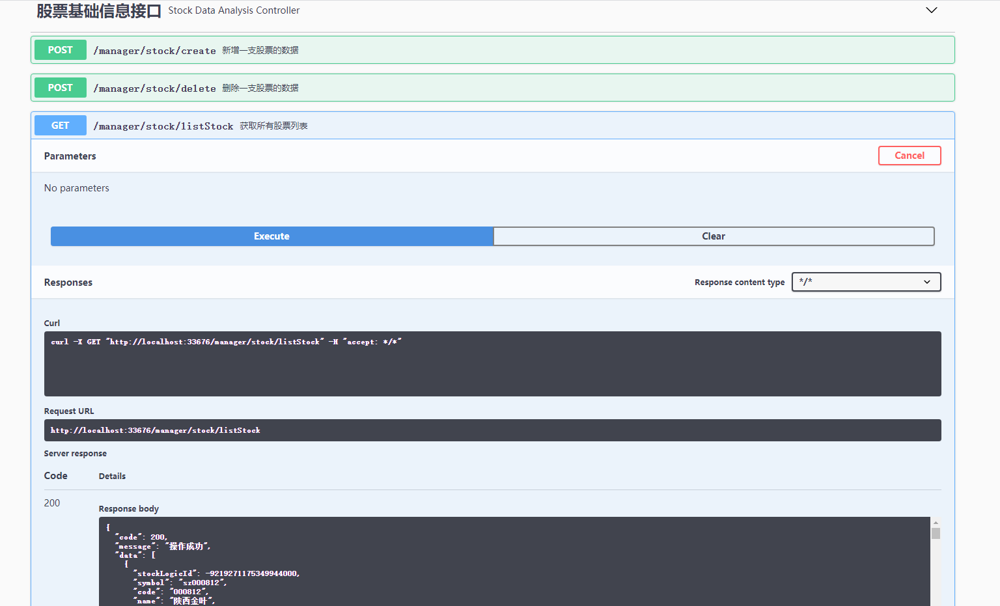

# Swagger基础用法

```
Swagger可以动态的生成在线API文档，并且可以在网页调试，http://项目地址:项目端口/swagger-ui.html。
```

1. 第一步 增加Swagger依赖

```
<!--Swagger-UI API文档生产工具-->
<dependency>
  <groupId>io.springfox</groupId>
  <artifactId>springfox-swagger2</artifactId>
  <version>2.7.0</version>
</dependency>
<dependency>
  <groupId>io.springfox</groupId>
  <artifactId>springfox-swagger-ui</artifactId>
  <version>2.7.0</version>
</dependency>
```

2. 第二步 Swagger2Config配置

```

import io.swagger.annotations.Api;
import io.swagger.annotations.ApiOperation;
import org.springframework.context.annotation.Bean;
import org.springframework.context.annotation.Configuration;
import springfox.documentation.builders.ApiInfoBuilder;
import springfox.documentation.builders.PathSelectors;
import springfox.documentation.builders.RequestHandlerSelectors;
import springfox.documentation.service.ApiInfo;
import springfox.documentation.service.Contact;
import springfox.documentation.spi.DocumentationType;
import springfox.documentation.spring.web.plugins.Docket;
import springfox.documentation.swagger2.annotations.EnableSwagger2;

  /**
  * Swagger2API文档的配置
  */
  @Configuration
  @EnableSwagger2
  public class Swagger2Config {
  @Bean
  public Docket createRestApi() {
  return new Docket(DocumentationType.SWAGGER_2)
  .apiInfo(apiInfo())
  .select()
  .apis(RequestHandlerSelectors.basePackage("cloud.analysisservice.controller"))
  //                为有@Api注解的Controller生成API文档
  .apis(RequestHandlerSelectors.withClassAnnotation(Api.class))
  //                为有@ApiOperation注解的方法生成API文档
  .apis(RequestHandlerSelectors.withMethodAnnotation(ApiOperation.class))
  .paths(PathSelectors.any())
  .build();
  }

  private ApiInfo apiInfo() {
  return new ApiInfoBuilder()
  .title("nuna-stockAPI接口文档")
  .description("nuna-stock")
  .contact(new Contact("Vincent", null, null))
  .version("1.0.0")
  .build();
  }
  }

```

3. Swagger 注解使用

```
@Api(tags = ""):放在具体的Controller上，表明这是一个接口
@ApiOperation("")：放在处理的方法上，表明这是处理具体url的方法
@ApiModelProperty() 放置在接口常数的实体类的属性上
public class Data implements Serializable {
    @ApiModelProperty(value = "逻辑主键")
    private Long stockLogicId;
}
```
4. 运行项目


## 参考案例

1. https://swagger.io/ swagger官网
2. http://www.macrozheng.com/#/architect/mall_arch_02

