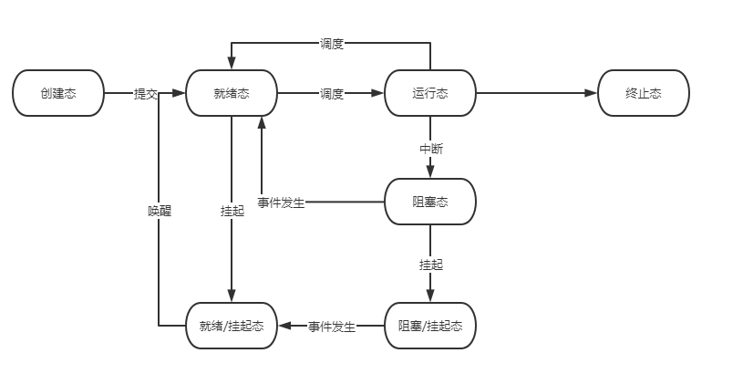

Linux内核 github上linux内核

## 进程和线程

### 七状态模型
1. 创建态:进程创建完成，分配内存等工作完成，提交调度队列
2. 就绪态:进程等待被调度，等待切换CPU
3. 运行态:正在CPU中执行代码
4. 阻塞态:等待事件发生,IO操作完成
5. 终止态:程序运行结束（退出有四种情况，参考优雅停机的知识点）
6. 阻塞挂起态:阻塞过程中，进程部分内存被交换到硬盘
7. 就绪挂起态:阻塞挂起态中，事件发生导致进程变为就绪可执行
8. LINUX线程的Reator模型

## 进程间通信

## 调度

## Linux 五种网络IO模型

阻塞式IO模型
非阻塞式IO模型
IO复用
select/poll/epoll
信号驱动IO模型
异步IO模型

网络IO的零拷贝
