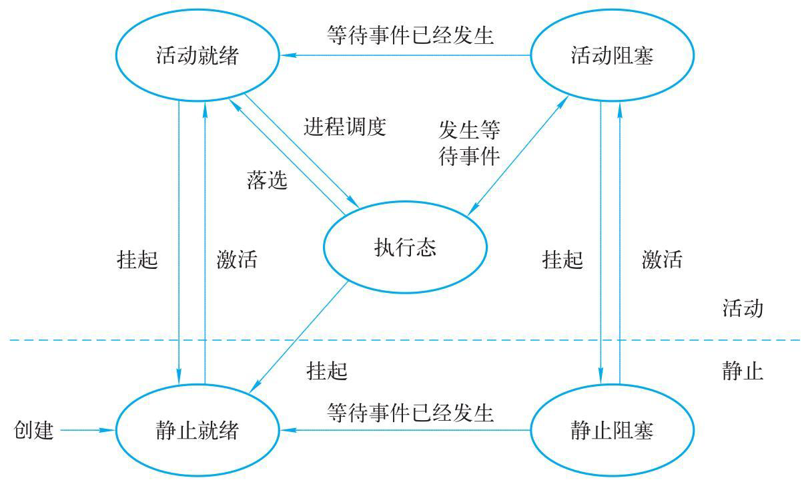

# 进程与进程管理

## 进程的引入

进程是对正在运行的程序的一个抽象。

### 程序的顺序执行

1. 程序在执行的时候，必须按照某种先后次序逐个执行，仅当前的已操作执行完后，才能执行后继操作。
2. 程序顺序执行的特征：

- 程序执行的顺序性：只有前一操作结束后才能执行后续操作
- 程序执行的封闭性：独占全机资源，因而机内资源只有本机才能改变
- 程序执行结果的确定性：程序执行的结果与它的执行速度无关，无论是从头到尾的执行还是停停走走的执行，都不会影响最终结果。
- 程序结果的再见性：只要程序执行时的环境与初始条件相同，当程序多次重复执行都将获得相同的结果。

### 程序的并发执行

1. 输入、计算、打印三个程序进行处理时可使它们并发执行。
2. 程序并发执行的特征：

- 程序执行的间断性：相互制约将导致并发程序具有“执行——暂停执行——执行”这种间断性活动规律
- 程序执行失去封闭性：多个程序共享系统中的各种资源
- 程序执行结果的不可再现性：资源没有独占，程序经过多次执行后，虽然其执行环境和初始条件都相同，但得到的结果却不相同。
- 程序和计算不再一一对应：程序和计算是两个不同的概念。程序是指令的有限集合，计算是执行操作的过程。

3. 引入并发编程的目的是提高到资源利用率。

### 多道程序设计

1. 计算机系统中，允许多个程序同时进入一个计算机系统的内存并运行，这种让多个程序同时进入计算机计算的方法成为多道程序设计
2. 实现多道程序设计必须妥善解决的3个问题

- 存储保护与程序浮动
- 处理机的管理和调度
- 系统资源的管理和调度

## 进程

1. 程序段、数据段及进程控制块3部分构成了一个进程的实体

### 进程的概念

1. 进程是具有独立功能的可并发执行的程序再一个数据集合上的运行过程，是系统进行资源分配和调度的独立单位。

- “一个中心，两个基本点” 一个中心是具有独立功能的可并发执行的程序再一个数据集合上的运行过程。两个基本点：资源分配，调度的独立单位。

### 进程的基本状态及其转换



### 进程控制块

1. PCB记录了操作系统所需的、用于描述进程情况及控制进程运行所需要的全部信息。操作系统是根据PCB来对并发执行的进程进行控制和管理的。
2. 进程控制块包含的信息

- 进程标识符信息：外部标识符、内部标识符
- 处理机状态信息：通用寄存器、指令计数器、程序状态字、用户栈指针
- 进程调度信息：进程状态、进程优先级、进程调度相关信息（调度算法）、事件
- 进程控制信息：程序和数据地址、进程同步和通信机制、资源清单、链接指针 3。 进程控制块的组织方式：链接方式、索引方式

### 进程控制

1. 进程控制的主要任务是创建和撤销进程以及实现进程的状态转换，进程控制
2. 进程控制的主要功能是由操作系统内核实现的，操作系统内核的功能主要包括：

- 中断处理：各种类型的系统调用、键盘命令的输入、进程调度、设备驱动及文件操作
- 进程管理；进程的建立和撤销、进程状态的转换、进程调度、控制进程的并发执行
- 资源管理中的基本操作

## 进程的调度

1. 调度的基本概念

- 高级调度：决定哪些外存上处于后备状态的作业调度调入主机内存，准备执行
- 中级调度：在内存和外存对换区之间进行进程对换
- 低级调度：决定就绪队列中哪个进程将获得处理机

2. 进程调度方式

- 非剥夺的方式：分派程序一旦吧处理及分配给某进程后便让它一直运行下去，直到进程完成或发生某事件而阻塞时才把处理机分配给另外一进程
- 剥夺的方式：系统可以基于某种原则剥夺已分配给它的处理机，优先权原则、短进程优先、时间片原则

3. 进程调度算法

- 先进先出算法
- 最短处理机运行期优先调度算法
- 最高响应比优先调度算法
- 优先级调度算法
- 前后台调度算法
- -时间片轮转调度算法
- 多级反馈队列轮转算法

```
多级反馈队列轮转算法算法具体描述系统设置多个就绪队列，且在其生命周期内可能再多队列中存在。
通常刚创建的进程因请求IO未用完时间片的进程排在最高优先级队列，在这个队列中运行2~3时间片未完成的进程排入下一较低优先级队列，这样系统设置多个优先级队列。 
系统在调度时，总是先调度优先级最高的队列。l
```

4. 进程调度的过程

```
进程调度所依赖的数据结构通常时调度队列，在单处理机系统中设置了多种等待队列。 
例如，等待处理机的就绪队列、等待IO请求响应的设备队列、等待实时时钟的睡眠队列、等待通信信息的通信队列等。
上述队列的进程都可能引起调度，即将进程从相应队列中取出插入就绪队列，也就相应改变进程的状态，从而形成状态的转换。
就绪队列中的进程已按其优先级的大小排列并允许剥夺调度，当就绪队列的队首出现其优先级比当前正在执行进程更高优先级的进程时，
应立即停止当前进程的执行并将它按优先级大小，插入到就绪队列中的适当位置上。
然后用高优先级进程保存的处理机现场去恢复处理机现场。
```

## 线程的基本概念

### 线程的引入

操作系统中引入进程的目的时使多个程序并发执行以改善资源利用率及提高系统吞吐量。 操作系统中引入线程的目的时为了减少程序并发执行所付出的时空开销。

### 线程的定义和属性

1. 线程定义：线程是进程的一个实体，是被系统独立调度和分派的基本单位。
2. 线程属性：

- 线程标识符、线程描述表（记录了线程执行的寄存器和栈等现场状态）
- 不同线程可以执行相同的程序
- 同一进程的各个线程共享该进程的内存地址空间
- 线程是处理机的独立调度单位
- 线程具有生命周期

### 线程的实现机制

1. 两种类型的线程

```
用户线程和内核支持线程（但是无论任何进程都是与内核有关，是内核支持下进行切换的，内核中保留了一张线程控制块，内核根据该控制块而感知该线程的存在并对线程进行控制）
```

2. 用户级线程和内核级支持线程的比较
- 线程的调度和切换速度
```
内核级线程调度和切换与进程的调度和切换十分相似。
用户级线程的线程通常是发生在一个应用的诸进程中，用户级线程无需通过中断进入操作系统
```
- 系统调用
```
用户进程调用一个系统调用时，由用户态转入核心态，用户进程将被阻塞。
内核级线程不会阻塞进程，可以调度该进程的其他线程
用户级线程会被阻塞当前进程，
```
- 线程执行时间
```
只设置用户级线程的系统，调度是以用户进程为单位调度的。
内核级线程的系统，调度是按照用户进程的中线程为单位调度的
```

## Linux的进程和进程管理
Linux系统住哟活动的就是进程，每个进程执行一段独立的程序并在进程初始化时拥有一个独立的控制线程。
Linux是一个多道程序设计系统，系统中有多个批次互相独立的进程在同时运行。

### Linux的进程结构与进程控制
1. 任意一台Linux的/usr/src/kernels/******（内核版本）/include/linux/sched.h文件定义的task_struct记录了进程控制块
- 进程状态:/* -1 unrunnable, 0 runnable, >0 stopped */进程状态Linux分为运行态、等待态、暂停态、僵尸态
- 进程调度信息：用于进程调度、决定优先级
- 进程标识：进程唯一标识PID、组标识GID
- 内部通信信息：用于消息队列、信号量或共享内存等进程通信操作
- 进程指针：父子进程、兄弟进程
- 时钟信息：用于追踪使用处理机时间，软件定时
- 文件系统：记录进程访问文件的信息
- 虚拟内存信息：记录进程的内存空间分配信息
- 进程上下文：当前运行现场信息
- 
### Linux的核心进程调度

### 常见问题

1. 进程与程序的区别与联系

- 进程是程序的一次执行，它是一个动态的概念，程序是完成某个特定功能的指令的有序序列，是一个静态的概念。
- 进程是资源分配和独立调度的单位，程序是一种软件资源。

2. 线程与进程的比较

- 调度：线程是调度的基本单位、进程是分派资源的基本单位
- 并发性：进程和线程都具有并发性，进程阻塞便不再提供服务，当时线程阻塞，可由其他其他线程提供服务
- 拥有资源：进程可以直接拥有系统资源（代码段、数据段、已打开的文件、I/O设备）。而线程只拥有少量必不可少资源（局部变量，线程堆栈等），数据来源主要是共享进程的资源。
- 系统开销：创建或撤销进程时，需要分配或回收资源（内存空间、IO设备），进程切换时涉及处理机环境的保存以及调度进程的处理机环境设置。线程切换只需要保存和设置少量寄存器的内容。

# 参考资料 <现代操作系统>