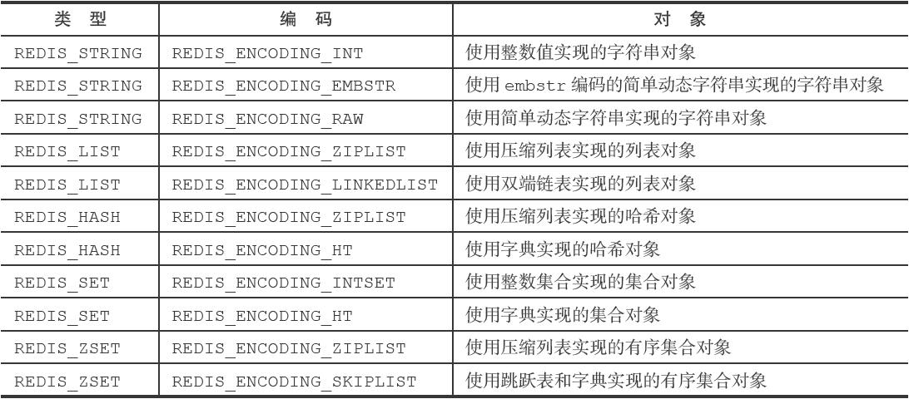

# Redis数据库

## 第一部分 数据结构

1. 简单动态字符串

```
struct sdshdr{
    //等于SDS所保存字符串的长度
    int len;
    //buf 数组中未使用字节的数量
    int free;
    // 字节数组，用户保存字符串
    char buf[];
}

SDS与C字符串的区别：
（1）常数复杂度获取字符串的长度、杜绝缓冲区溢出、减少修改字符串带来的内存重分配次数
（2）二进制安全（用空字符来分割单词的特殊数据格式，为了确保Redis适用于各种不同的使用场景，SDS的API是二进制安全的）
```

2. 链表

```
链表在Redis中的应用非常广泛，比如列表键的底层实现之一就是链表，发布与订阅、慢查询、监视器等等功能也用到了链表
Redis的链表实现特性为双端、无环,具体代码实现
typedef struct listNode{
    struct listNode *prev;
    struct listNode *next;
    void *value;
}listNode
typedef struct list{
    //链表的表头指针
    listNode *head;
    //链表的表尾指针
    listNode *tail;
    //链表长度的计数器
    unsigned long len;
    //节点值复制函数
    void *(*dup)(void *ptr);
    //节点值释放函数
    void (*free)(void *ptr);
    //节点值对比函数
    int (*match)(void *ptr,void *key);
}list
```

3. 字典

```
Redis的字典使用哈希表作为底层实现，一个哈希表里面可以由多个哈希表节点。而每个哈希表节点就保存字典的一个键值对。
哈希表定义
typedef struct dictht{
    //哈希表数组
    dictEntry **table;
    //哈希表大小
    unsigned long size;
    //哈希表大小掩码，用于计算索引值
    unsigned long long sizemask;
    //哈希表已有节点数量
    unsigned long used;
}
哈希表节点
typedef struct dictEntry{
    void *key;
    union{
        void *val;
        uint64_tu64;
        int64_ts64;
    } v;
    struct dictEntry *next;
}dictEntry;
Redis中字典表示
typedef struct dict{
    dicType *type;
    void * privdata;
    dict ht[2];
    in trhashidx;
} dict;

哈希算法
（1）插入操作
当要将一个新的键值对添加到字典里面时，程序需要先根据键值对计算出哈希值和索引值，然后再根据索引值，将包含新键值对的哈希表节点放到哈希表数组的指定索引上。
（2） 解决键冲突
解决键冲突，当有两个或以上的数量的间被分配到哈希表数组的同一个索引上面时，我们称这些键发生了冲突。
Redis的哈希表使用了链地址法来解决键冲突，每个哈希表节点都有一个next指针，多个哈希表节点可以用next指针构成一个单向链表，
被分配到同一个索引的多个节点可以用这个单向链表链接起来，这就解决了键冲突的问题。
（3） rehash
随着操作的不断执行，哈希表保存的键值对会逐渐地增多或者减少，
为了让哈希表的负载因子维持在一个合理的范围内，当哈希表保存的键值对数据太多或者太少时，程序需要对哈希表的大小进行相应的扩展或者收缩。
扩展和收缩哈希表的工作可以通过执行rehash操作来完成，redis对字典的哈希表执行rehash的步骤如下:
第一步:为字典的哈希表分配空间h[1]，大小通常为2的n次方幂
第二步:将原有哈希表h[0]的键值对迁移到h[1]
第三步:释放h[0],并且把h[1]设置为h[0],并且为h[1]新创建一个空白哈希表，为下一次rehash做准备
第四步：但是rehash操作并不是一次性、集中式地完成的，而是分多次、渐进式地完成的。
```

4. 跳跃表

```
（1）跳跃表的定义
跳跃表是一种有序数据结构，它通过在每个节点中维持多个指向其他节点的指针，从而快速访问节点的目的。
跳跃表支持平均O(logN)、最坏O(N)复杂度的节点查找，还可以通过顺序操作来批量处理节点。
跳跃表的效率可以和平衡树相媲美，并且因为跳跃表的实现比平衡树要来得更为简单，所以使用跳跃表来代替平衡树。
（2） 跳跃表的实现

```

6. 整数集合
7. 压缩列表
8. 对象

- 字符串对象
- 列表对象
- 哈希对象
- 集合对象
- 有序集合对象
- 对象类型和编码

```
(1) 对象类型
Redis中的每一个对象是由一个redisObject
typedef struct redisObject{
    //类型
    unsighed type:4;{REDIS_STRING,REDIS_LIST,REDIS_HASH,REDIS_SET,REDIS_ZSET}
    //编码
    unsigned encoding:4;
    //指向底层实现数据结构的指针
    void *ptr;
}
(2) 类型 TYPE命令
TYPE 命令能够返回数据库建对应的值对象的类型
#键为字符串对象，值为字符串对象
redis＞ SET msg "hello world"
OK
redis＞ TYPE msg
string
#键为字符串对象，值为列表对象
redis＞ RPUSH numbers 1 3 5
(integer) 6
redis＞ TYPE numbers
list
#键为字符串对象，值为哈希对象
redis＞ HMSET profile name Tom age 25 career Programmer
OK
redis＞ TYPE profile
hash
#键为字符串对象，值为集合对象
redis＞ SADD fruits apple banana cherry
(integer) 3
redis＞ TYPE fruits
set
#键为字符串对象，值为有序集合对象
redis＞ ZADD price 8.5 apple 5.0 banana 6.0 cherry
(integer) 3
redis＞ TYPE price
zset

（3）编码
OBJECT ENCODING命令可以查看一个数据库键的值对象的编码，
RedisObject属性记录了对象所使用的编码，也即是说这个对象使用了什么数据结构作为对象的底层实现

举例子，链表对象，元素较少时使用压缩列表能够更节约内存进而更快的被加载到内存中，元素较多时则使用双端链表
```

-

## 第二部分 redis数据库

1.Redis服务器中的数据库

```
（1）数据库键空间
struct redisServer{
    ...
    //一个数组，保存着服务器中的所有数据库
    redisDb *db;
    //服务器的数据库数量，默认16
    in dnum;
    ... 
}
（2）读写键空间时的维护操作
读取一个键，服务器会根据键是否存在来更新服务器的键空间命中次数或键空间不命中次数 （INFO stats命令）。
读取一个键之后，服务器会更新键的LRU（最后一次使用）时间。这个值可以用于计算键的闲置时间，使用Object idletime命令可以查看键key的闲置时间。
121.89.194.175:0>OBJECT idletime alphabet
"231"
如果服务器在读取一个键时发现该键已经过期，那么服务器会先删除这个过期键。然后才执行余下的其他操作。
如果客户端使用Watch命令监视了某个键，那么服务器在对监视的键进行修改后，会把这个键标记为脏，从而让十五程序注意到这个键已经修改过。
服务器每次修改一个键之后，都会对脏键计数器的值增加1，这个计数器会出发服务器的持久化以及复制操作
如果服务器开启了数据库通知功能，那么在对键进行修改之后，服务器将按配置发送相应的数据库通知。
（3）设置键的生存时间或过期时间
通过EXPIRE命令或者PEXPIRE（设置键过期时间精确至毫秒）,客户端可以以秒或者毫秒精度为数据库中的某个键设置生存时间（Time To Live）TTL。
在经过指定的秒数或者毫秒数之后，服务器就会自动删除生存时间为0的键。
主要有四个命令额能够设置键的生存时间或者过期时间戳
EXPRIE <key> <ttl>
EXPRIEAT <key> <timestamp>
PEXPRIE <key> <ttl>
PEXPRIEAT <key> <timestamp>
虽然有多种不同单位和不同形式的设置命令，但实际上EXPIRE、PEXPIRE、EXPIREAT都是使用PEXPRIREAT命令来实现的
redisDb结构的expires字典保存了数据库中所有键的过期时间，我们称这个字典为过期字典:
typedef struct redisDb{
    // ...
    //过期字典，保存着键的过期时间
    dict *expires；
    // ...
}redisDb

过期字典的键是一个指针，这个指针指向键空间的某个键对象
过期字典的值是一个long long类整数

（4）过期键的判定
TTL命令或者PTTL命令能够计算并返回剩余生存时间
检查给定键是否存在于过期字典：如果存在，那么取得键的过期时间
检查给定键是否存在于过期字典，如果存在，那么取得键的过期时间
检查当前UNIX时间戳是否大于键的过期时间，如果是的话，那么键已过期。
（5）过期键删除策略
如果一个键过期了，那么它什么时候会被删除呢？
三种过期键的删除策略
定时删除：设置键的过期时间同时，创建定时器
惰性删除：从键空间获取键时，都检查取得的键是否过期，过期则删除
定期删除：每隔一段时间，程序就会对数据库进行检查，删除过期键
```

2. RDB持久化与AOF持久化
```
Redis是一个键值对数据库服务器，服务器中通常包含着任意个非空服务器
```

## 第三部分 redis集群

参考《redis设计与实现》