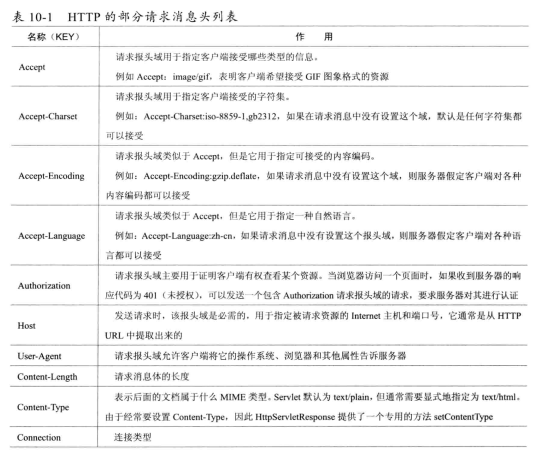
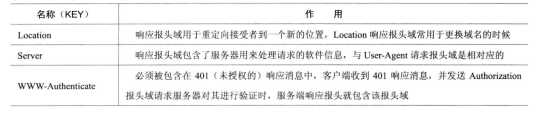

# HTTP协议

## HTTP概述

```
Http是一个属于应用层的面向对象的协议，由于其简捷，快速的方式，适用于分布式超媒体信息系统。
HTTP主要特点
（1）支持Client/Server模式
（2）简单：客户端服务器请求服务时，只需要指定服务时，只需要指定服务URL，携带必要请求参数或者消息体。
（3）灵活：HTTP允许传输任意类型的数据对象，传输的内容类型由HTTP消息头中的Content-Type加以标记。
（4）无状态：
HTTP是无状态协议，无状态是指协议对于事务处理没有记忆能力。
缺少状态意味着如果后续处理需要之前的信息，则它必须重传，这样可能导致每次连接传送的数据量增大。
如果服务器不需要先前信息时它的应答就比较快，负载较轻。
```

## HTTP协议的URL

```
HTTP的URL是一种特殊类型的URI，包含了用于查找某种资源的足够信息
格式：http://host[":"port][abs_path]
http:表示要通过HTTP协议来定位网络资源
host:表示合法的Internet主机域名或者IP地址
port:指定端口，默认端口为80
abs_path:当它作为请求URI时，必须以"/"的形式给出，通常这点工作浏览器会自动帮我们完成。
```

## HTTP请求消息

```
（1）请求行
请求行格式：Method Request-URI HTTP-Version CRLF
请求行各字段具体含义:
Method:表示请求方法
Request-URI:是一个统一的资源标识符
HTTP-Version:表示请求的HTTP版本号
CRLF:表示回车换行

请求方法有很多种：各方法作用如下
GET：请求获取Request-URI所标识的资源
POST：在Request-URI所表示的资源后附加新的提交数据
PUT：请求服务器存储一个资源，并用Request-URI作为其标识
DELETE：请求服务器删除Request-URI作为其标识
HEAD：请求获取由Request-URI所标识的资源的响应消息报文头
TRACE：请求服务器回送收到的请求信息，主要用于测试或者诊断
CONNECT：保留将来使用
OPTIONS：请求查询服务器的性能，或者查询与资源相关的选项和需求

POST和GET请求方法的区别：
<1>根据HTTP规范，GET请求用于信息获取，而且应该是安全和幂等：POST则表示可能修改服务器上的请求
<2>GET请求，提交的数据会附在URL之后，就是把数据放置在请求行，以？分割URL和传输数据，多个常数用&连接。
POST提交会把提交的数据放置在HTTP消息的包体，数据不会在地址栏中显示出来。
<3>特定浏览器和服务器对URL长度有限制，IE对URL的长度限制是2083字节。
<4>安全性。GET请求明文显示，登录页面有可能会被浏览器缓存。GET提交数据可能会存在CSRF攻击。

（2）请求头
请求报文头允许客户端向服务端传递请求的附加信息以及客户端自身的信息。
（3）请求正文
HTTP请求消息体是可选的，比如说Spring-Rest-Web 是把json字符串序列为对象传入到Controller的@GetMapping方法内

```


## HTTP响应消息

```
（1）状态行
状态行格式：HTTP-Version Status-Code Reason_Phrase CRLF
HTTP-Verison:表示服务器HTTP协议的版本
Status-Code:表示服务器返回的响应状态代码
Reason-Phrase: 描述信息
1xx:指示信息。表示请求已接收，继续处理
2xx:成功。表示请求已被成功接收、理解、接收
3xx:重定向：要完成请求必须进行进一步的操作
4xx:客户端错误。请求有语法错误
5xxL:服务端错误。服务器未能处理请求
（2）响应报头
（3）响应正文
Spring-Rest-Web 是把Java对象序列化为json字符串，填充到response里面
```



# HTTPS
## HTTP的缺点
```这些问题不仅在HTTP上出现，其他未加密的协议中也会存在类似的问题```
1. 窃听:通信使用明文（不加密），内容可能会被窃听
```
（1）为什么HTTP会被窃听？
最根本的原因是TCP/IP的通信机制。
因为互联网是由连通到全世界的网络所组成的。无论世界的哪个角落的服务器在和客户端通信时，
在此通信线路上的某些设备、光缆、计算机等都不可能是个人的私有物，所以不排除某个环节中会遭到恶意窥视行为。
窃听相同段上的通信并非难事。可以借助类似WireShark等抓包工具，就可以获取HTTp协议的请求和响应内容。
（2）加密处理防止被窃听
两种办法:
2.1 HTTPS:通过SSL/TLS组合使用，加密HTTP的通信内容，建立安全通信线路。与SSL组合使用的HTTP称为HTTPS
2.2 内容加密:把HTTP报文里所含的内容进行加密处理,不过这个要求服务端与客户端同时具备加密和解密机制
```
2. 身份伪装:不验证对方身份，因此有可能遭遇伪装
```
（1）原因：请求报文可以被窃听，攻击者可盗用身份。然而服务器可接收攻击者请求
（2）证书：
```
3. 篡改:无法验证报文的完整性，所以有可能被篡改
```

```


