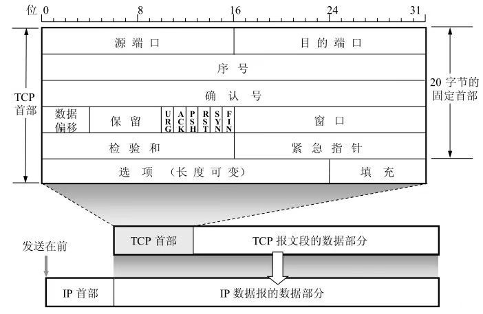
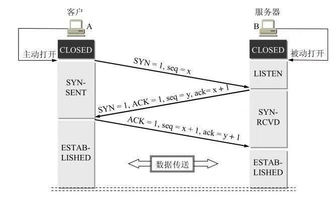
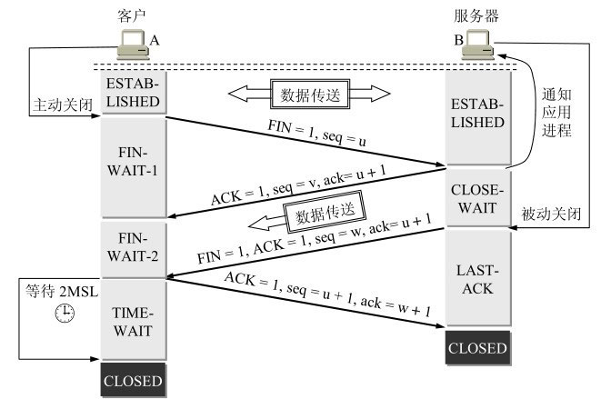
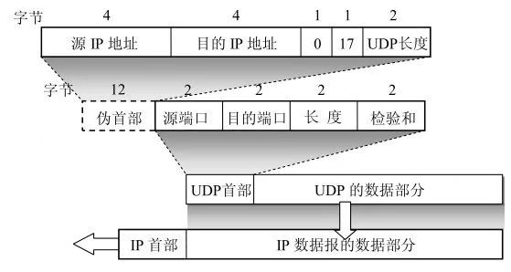

# 一、TCP
1. TCP三次握手和四次挥手

- 
- TCP报文首部格式各字段含义：
- 源端口号和目的端口号：大小2字节，表示建立连接两边进程的端口号
- 序号：大小四字节,表示要发送的报文的第一个的字节的编号
- 确认号：四字节，是期望收到对方下一个报文段的第一个数字字节的序号
- 数据偏移：占4位，单位是4字节，表示TCP报文的首部长度，TCP首部长度最大值为60字节
- 保留：6位
- 控制位：6位 URG：紧急报文、ACK：建立连接ACK=1表示报文有效、PSH：推送模式、RST：复位、SYN：同步，SYN=1表示正在建立连接、FIN：终止，FIN=1表示释放连接
- 窗口：2字节，滑动窗口中表示发送数据量大小
- 检验和：2字节
- 紧急指针：2字节
- 选项：可变长度的，最大40字节

2. 三次握手 
- 
- 上图画出了TCP建立连接的过程。假定主机A运行的是TCP客户程序，而B运行的是TCP服务程序。最初两端的TCP进程都处于Closed状态
然后A主动打开连接，而B被动打开连接。然后A、B分别创建传输控制块TCB，然后B转入Listen状态。
第一步：A向B发送SYN=1，seq=x的状态。A转入SNET-SYN状态。
第二步：B收到连接请求报文以后，如果同意建立连接，则向A发送确认报文SYN=1,ACK=1,ack=x+1,seq=y。B转入SYN-RCVD状态
第三步：A收到B的确认报文以后，会向B发送ACK=1，seq=x+1，ack=y+1。A会状态会转入已建立连接
第四步：B收到A的应答报文后，B状态转入已建立连接。

3. 四次挥手
 - 
# 二、UDP
1. UDP报文首部格式
- 
- 原端口号:在需要对方回信时选用。不需要时可全用0
- 目的端口：目的端口号。这在重点交付报文时必须要使用到。
- 长度：UDP用户数据报的长度
- 检验和 检测UDP用户数据报在传输中是否有错

# 三、常见问题
1. 为什么是三次握手不是两次握手
```
《计算机网络》-谢希仁
已失效的连接请求报文段”的产生在这样一种情况下：client发出的第一个连接请求报文段并没有丢失，而是在某个网络结点长时间的滞留了，
以致延误到连接释放以后的某个时间才到达server。本来这是一个早已失效的报文段。
但server收到此失效的连接请求报文段后，
就误认为是client再次发出的一个新的连接请求。于是就向client发出确认报文段，同意建立连接。假设不采用“三次握手”，那么只要server发出确认，新的连接就建立了。
由于现在client并没有发出建立连接的请求，因此不会理睬server的确认，也不会向server发送数据。但server却以为新的运输连接已经建立，并一直等待client发来数据。
这样，server的很多资源就白白浪费掉了。采用“三次握手”的办法可以防止上述现象发生。例如刚才那种情况，client不会向server的确认发出确认。server由于收不到确认，就知道client并没有要求建立连接。”

tcp是通过重传机制和确认机制来保证可靠通信的。如果部分SYN建立链接滞留在网络中，那么重传SYN链接会重新链接，造成资源的浪费。
```

2、TCP和UDP的区别
```
1. TCP面向连接，通过三次握手、四次挥手建立连接和释放连接的过程
2. TCP提供可靠服务。超时重传、流量控制、拥塞控制提供可靠性服务
3. TCP面向字节流
4. TCP连接提供点到点的通信。UDP提供一对一、一对多、多对多的交互通信。
5. TCP性能资源消耗更多，传输效率更慢
```