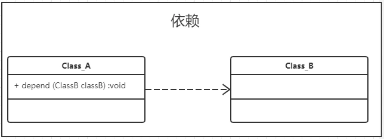
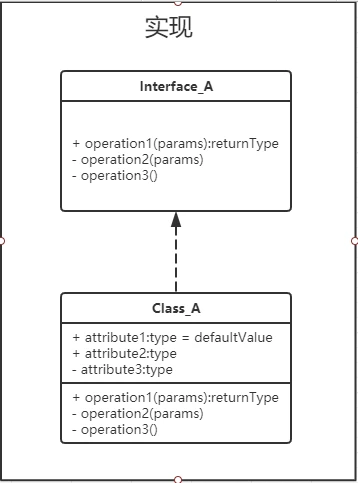
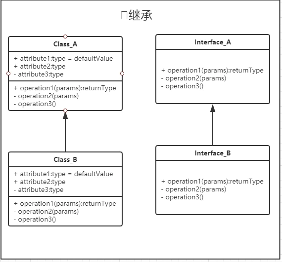
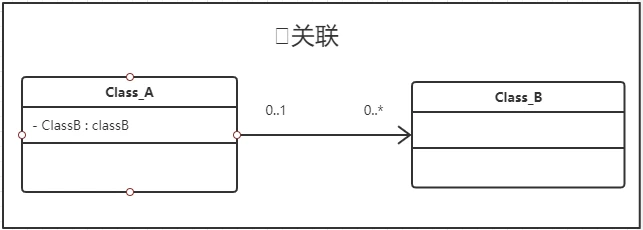
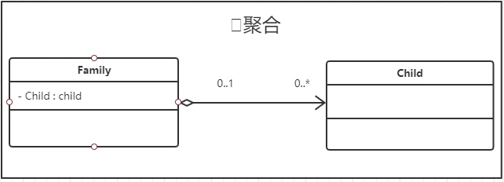
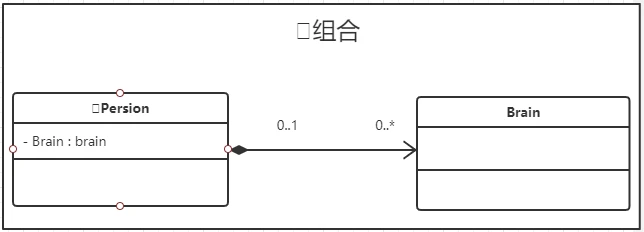

## 面向对象设计的六大原则
1. 单一职责原则
2. 里氏替换原则
3. 依赖倒转原则
4. 开闭原则
5. 迪米特原则
6. 接口隔离原则

## 类间关系

1、依赖

* 一个类使用了另外一个类
* 类(接口)使用另外一个类(接口)
* Java中表现为A类中方法使用B类最为形参、局部变量
---
 
---
2、实现

* 指的是一个class类实现一个或多个interface接口的功能
* 是类与接口间最常见的关系
* Java中通过implements关键字标识
---

---
3、继承
* 指一个类(接口)继承另外一个类(接口)的功能，并且可以增加它自己的新功能的能力
* 继承是类与类之间，接口与接口之间的关系
* Java中使用extends关键字明确标识
---

---

4、关联

* 强依赖关系
* 类(接口)使用另外一个类(接口)作为属性
* Java中体现为类属性或者静态变量
---

---
5、聚合

* 强关联关系，整体部分关系，整体部分可分割
* 类(接口)使用另外一个类(接口)作为属性
* Java中表现和关联一致，公有内部类
---
 
---

6、组合

* 强聚合关系，整体部分不可分割
* 类(接口)使用另外一个类(接口)作为属性
* Java中表现和关联一致，私有内部类
---

---